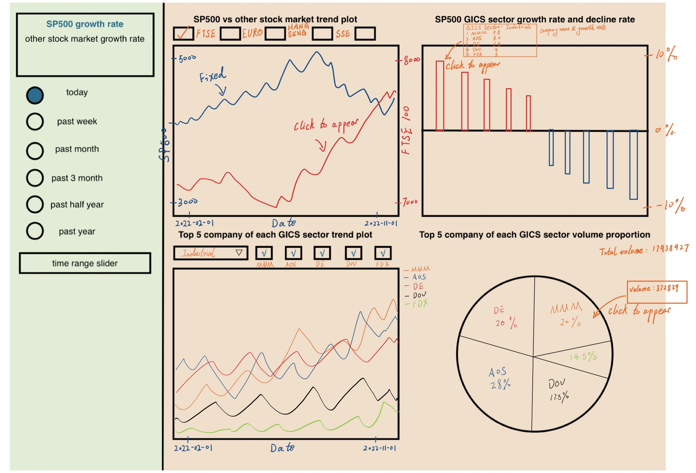

# Description of APP and sketch

We divided the page into two parts. On the left is a sidebar. On top of the sidebar shows general information like the growth rate of SP500 and other stock markets. Below are some time selectors. We plan to use an HTML radio (only 1 option can be chosen at a time) for time period selection and the options we provide include today, past week, past month, etc. This time period selector controls the data used for all plots on the right side of the page. 

On the right side, there are four graphs. The one in the left upper corner is a trend plot showing the general SP500 price by the minute or by day which also contains a checkbox selector on other stock markets to enable comparability. In the right upper corner is a bar chart showing the growth rate and decline rate of each GICS sector of SP500. At the bottom, there is a dropdown list for users to select which GICS sector they want to explore more. There are two plots for the top 5 companies of the selected GICS sector. On the left side is a trend plot showing the price change. We add a checkbox selector for users to select which company(s) among 5 to show on the plot. On the right side is a pie chart showing the proportion of the volume of 5 companies. After the user selects the companies on the left side, the corresponding sector of the pie chart on the right will highlight to make a clear comparative view.
